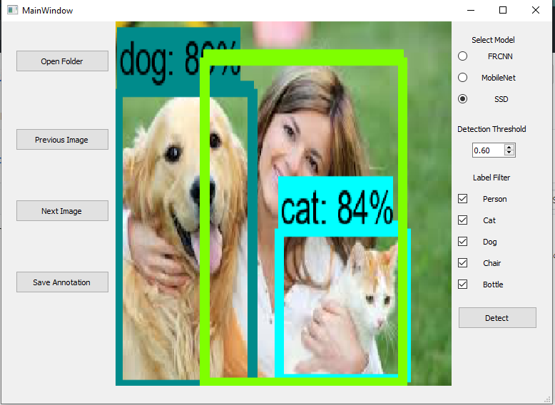
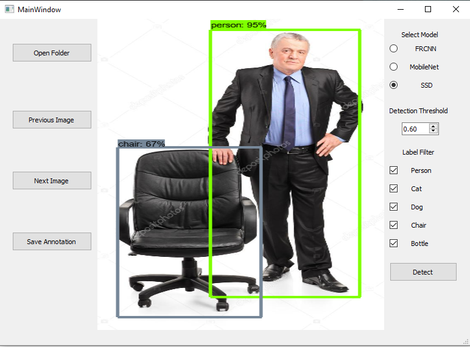
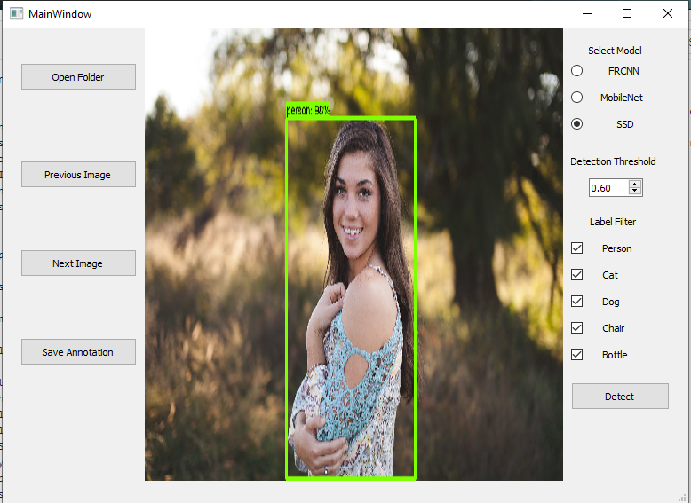

# Tensorflow Object detection GUI

The GUI is basically made to detect specific objects ie. Person, Cat, Dog, Chair, Bottle with a particular detection threshold. <br>
The main backend used over here is the Tensorflow Object Detection API. <br>
The TensorFlow Object Detection API is an open source framework built on top of TensorFlow that makes it easy to construct, train and deploy object detection models. <br>
This GUI is made using PyQt5 and can work both in Ubuntu as well as in Windows.<br>
<br>
Below are few Examples from the GUI

<p align="center">
  
</p>
<p align="center">
  
</p>
<p align="center">
  
</p>

# Setup
  
 ## Installation Guide

### Dependencies

Tensorflow Object Detection API depends on the following libraries:

*   Protobuf 3.0.0
*   Python-tk
*   Pillow 1.0
*   lxml
*   tf Slim (which is included in the "tensorflow/models/research/" checkout)
*   Jupyter notebook
*   Matplotlib
*   Tensorflow (>=1.12.0)
*   Cython
*   contextlib2
*   cocoapi

For detailed steps to install Tensorflow, follow the [Tensorflow installation
instructions](https://www.tensorflow.org/install/). A typical user can install
Tensorflow using one of the following commands:

``` bash
# For CPU
pip install tensorflow
# For GPU
pip install tensorflow-gpu
```

The remaining libraries can be installed on Ubuntu using via apt-get:

``` bash
sudo apt-get install protobuf-compiler python-pil python-lxml python-tk
pip install --user Cython
pip install --user contextlib2
pip install --user jupyter
pip install --user matplotlib
```

Alternatively, users can install dependencies using pip:

``` bash
pip install --user Cython
pip install --user contextlib2
pip install --user pillow
pip install --user lxml
pip install --user jupyter
pip install --user matplotlib
```

### Tensorflow Detection Model

3 different pre-trained object detection models of [COCO dataset] (http://mscoco.org) are being used in this Application. <br>

1. [ssd_mobilenet_v1_coco](http://download.tensorflow.org/models/object_detection/ssd_mobilenet_v1_coco_2018_01_28.tar.gz) 
2. [ssd_mobilenet_v1_ppn_coco](http://download.tensorflow.org/models/object_detection/ssd_mobilenet_v1_ppn_shared_box_predictor_300x300_coco14_sync_2018_07_03.tar.gz) 
3. [faster_rcnn_inception_v2_coco](http://download.tensorflow.org/models/object_detection/faster_rcnn_inception_v2_coco_2018_01_28.tar.gz)

Note: If you download the tar.gz file of quantized models and un-tar, you will get different set of files - a checkpoint, a config file and tflite frozen graphs (txt/binary).

You can un-tar each tar.gz file via, e.g.,:

```
tar -xzvf ssd_mobilenet_v1_coco.tar.gz
```

## Run the GUI

Clone the complete repository and put the models downloaded in an new folder named Models inside the main folder. <br>
And then run the following Command to use the application :


``` bash
python main.py
```

Select the folder in which you have the images and use previous and next button to change the images<br>
On the right hand side you have to select any model out of the 3 mentioned.<br>
Set the detection threshold (0.6 suggested) and then select the objects u want to detect. 
Click on the Detect Button to see the output. 

## Contributing
Pull requests are welcome. For major changes, please open an issue first to discuss what you would like to change.
<br>
Please make sure to test the application properly first.<br>
